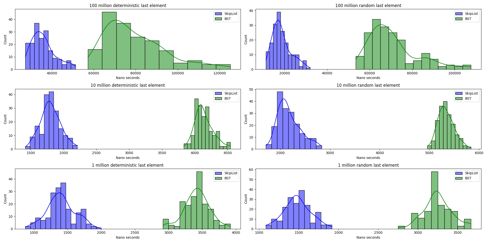
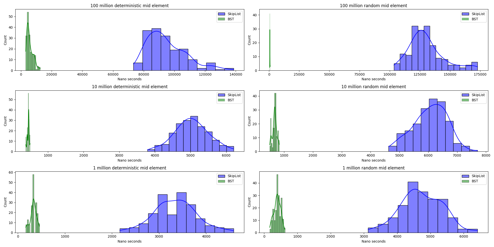
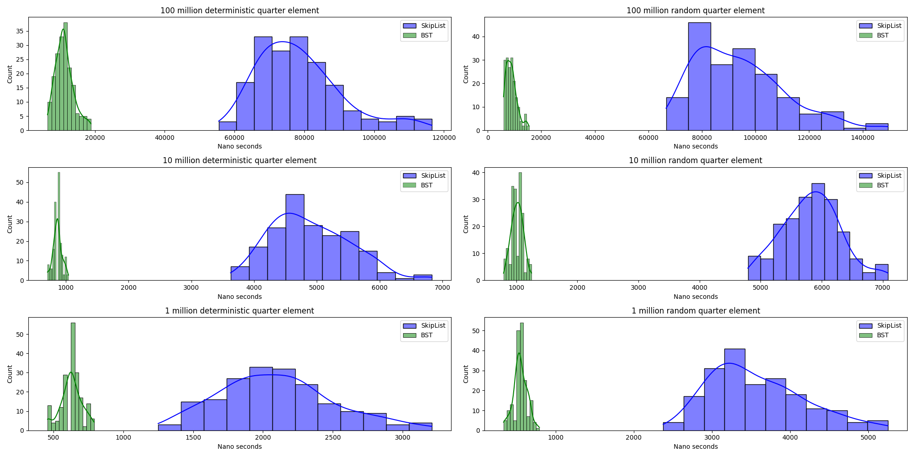
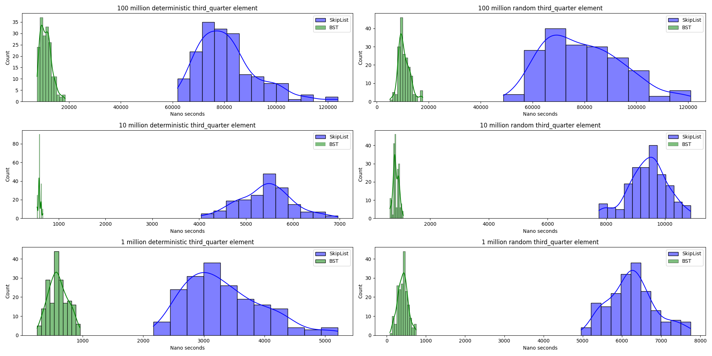
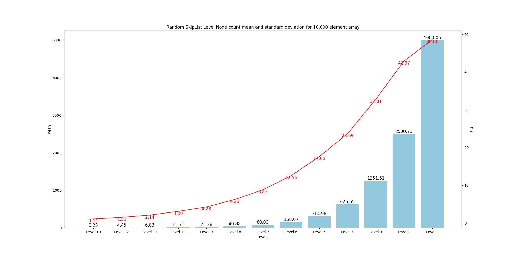
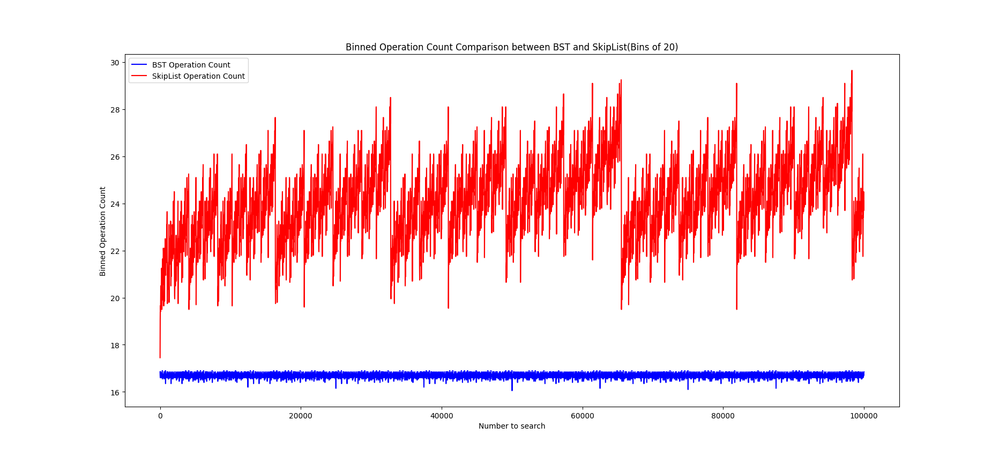
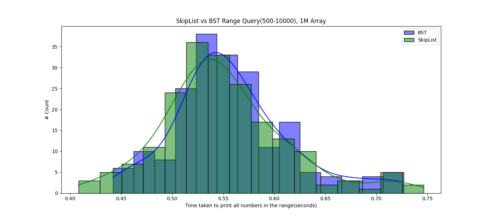

# Skip Lists implementation

Implementation of a famous data structure skip lists from scratch in C++. Reposistory also includes minimal implementation of BST(Binary search tree) and minimal implementation of Linked List data structures for comparison.

## Running code

If you want to run the code on MacOS or Linux, follow the instructions below:

1. Clone the repo `git clone https://github.com/Isalia20/Advanced-Algorithms-and-Data-Structures.git`

2. Go into the directory `cd SkipLists`

3. Choose whatever function you want to use in main.cpp by using any of the functions used in **SkipLists.h** file

4. Make the try_skip_list.cpp file with `make try_skiplist` (You can edit the file to try some other functions, now it only has build and print)

5. Run the file `./bin/skiplist`

## Statistical comparison of BST and SkipList

### BST vs SkipList (Searching Last Element)

This chart shows distribution of searching for the last element(e.g in 100 million array, the number we will be searching is 100 million)

### BST vs SkipList (Searching Middle Element)

This chart shows distribution of searching for the middle element(e.g in 100 million array 1/2 the number we will be searching is 50000000)

### BST vs SkipList (Searching Quarter Element)

This chart shows distribution of searching for the quarter element(e.g in 100 million array 1/4 the number we will be searching is 25000000)

### BST vs SkipList (Searching Third Quarter Element)

This chart shows distribution of searching for the third quarter element(e.g in 100 million array 3/4 the number we will be searching is 75000000)

### SkipList(Random) Level mean and standard deviation

This chart shows mean and standard deviation of the Skiplist data structure if we are building it randomly(i.e. on each element while building we flip a coin and grow one element up if it's 1 and continue onto the next element if it's 0)

### SkipList vs BST operation count

This chart shows operation count(if statement aggregates) for searching each element in a 100,000 element Skip List and BST. Numbers on the X axis are grouped into groups of 20(i.e. 0-20 operation count mean, 21-40 operation count mean etc.)
As we can observe on the chart, SkipList on average needs more operations to find the element. Some of the "falls" we observe on the SkipList line show
times when there is a skip connection from one node to another which reduces the operation count and overall mean for that group.

### SkipList vs BST Range Query Performance

This chart shows the performance difference between SkipList and BST for range query(for example print all numbers from X to Y which exist in SkipList/BST).
We can see that performance for both data structures are almost(if not totally) identical.

